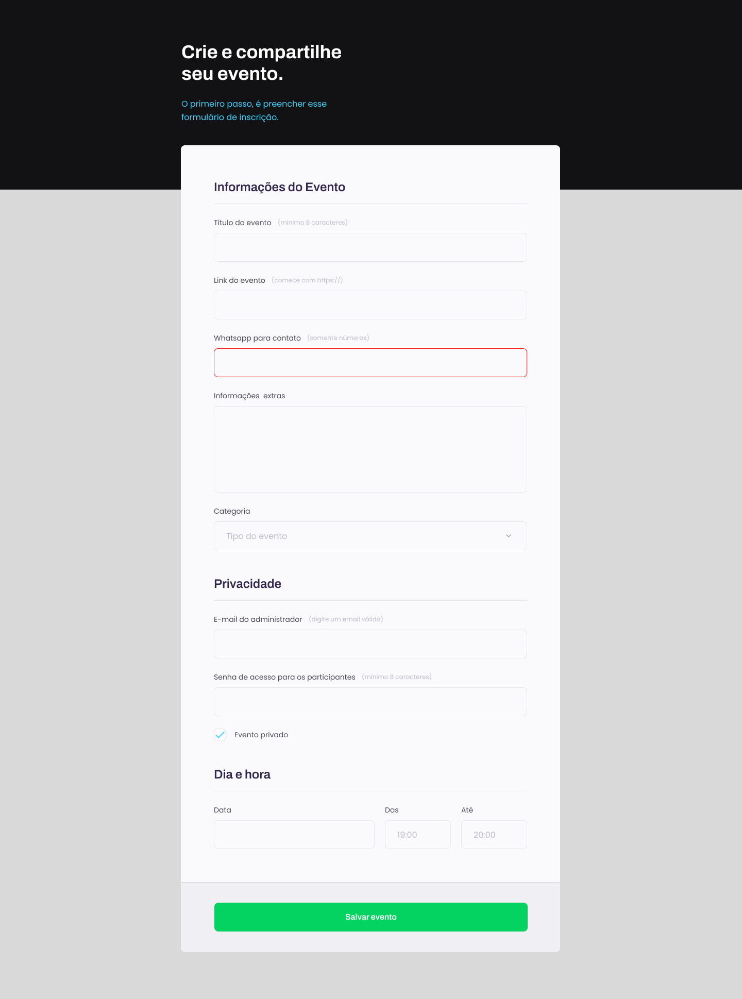

# Formulário de Eventos 📝

  

Aqui está o resultado da prática de um exercício proposto pela Rocketseat dentro da trilha EXPLORER nível 3.

## 🚀 Tecnologias

- HTML;
- CSS;
- GIT E GITHUB;
- FIGMA;

## 💻 Visite o site 

[Formulário de Eventos](https://danilojcosta.github.io/event-form/)

Made by Danilo and Rocketseat.
